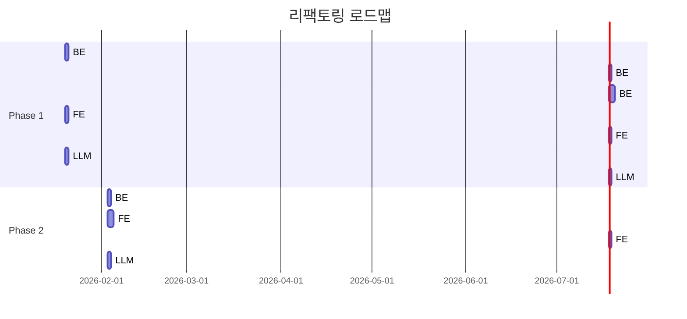

# PMS-IC 코드 인스펙션 보고서 및 개선 계획

> **작성일**: 2026-01-16
> **인스펙션 기준**: [code-inspection.md](../.claude/code-inspection.md), [coding-rules.md](../.claude/coding-rules.md)
> **대상**: 백엔드(Java), 프론트엔드(React), LLM-Service(Python)

---

## 목차

1. [개요](#1-개요)
2. [백엔드 인스펙션 결과](#2-백엔드-인스펙션-결과)
3. [프론트엔드 인스펙션 결과](#3-프론트엔드-인스펙션-결과)
4. [LLM-Service 인스펙션 결과](#4-llm-service-인스펙션-결과)
5. [통합 개선 계획](#5-통합-개선-계획)
6. [테스트 전략](#6-테스트-전략)
7. [예상 효과](#7-예상-효과)

---

## 1. 개요

### 1.1 인스펙션 목적

마틴 파울러의 『리팩토링』 원칙을 기반으로 코드의 **가독성**, **유지보수성**, **확장성**을 점검하고, 발견된 코드 스멜(Code Smell)에 대한 체계적인 개선 계획을 수립합니다.

### 1.2 프로젝트 구조

```
pms-ic/
├── PMS_IC_BackEnd_v1.2/     # Spring Boot 백엔드 (Java 21)
├── PMS_IC_FrontEnd_v1.2/    # React + Vite 프론트엔드 (TypeScript)
└── llm-service/             # Flask + LangGraph LLM 서비스 (Python)
```

### 1.3 인스펙션 결과 요약

| 서비스 | 긍정적 측면 | 발견된 이슈 | 심각도 |
|--------|------------|------------|--------|
| 백엔드 | DDD 패턴, Redis 캐싱, JWT 인증 | 6건 | 🔴 높음 2, 🟡 중간 3, 🟢 낮음 1 |
| 프론트엔드 | shadcn/ui, 역할 기반 접근 제어 | 7건 | 🔴 높음 2, 🟡 중간 5 |
| LLM-Service | LangGraph 워크플로우, 쿼리 개선 루프 | 7건 | 🔴 높음 2, 🟡 중간 4, 🟢 낮음 1 |

---

## 2. 백엔드 인스펙션 결과

### 2.1 긍정적인 측면

- **계층화된 아키텍처**: Controller → Service → Repository 패턴 일관 적용
- **캐싱 전략**: `@Cacheable`, `@CacheEvict` 활용한 Redis 캐싱
- **트랜잭션 관리**: `@Transactional(readOnly = true)` 적절히 분리
- **Lombok 활용**: 보일러플레이트 코드 최소화

### 2.2 발견된 코드 스멜

#### 🔴 BE-001: 장황한 메서드 (Long Method)

| 항목 | 내용 |
|------|------|
| **위치** | `ChatService.java:33-90` |
| **심각도** | 🔴 높음 |
| **설명** | `sendMessage` 메서드가 60줄, 7가지 책임 수행 |
| **책임 목록** | 1) 사용자 인증, 2) 세션 조회/생성, 3) 메시지 저장, 4) Redis 캐시 조회, 5) AI 호출, 6) 응답 저장, 7) 캐싱 |

```java
// 현재 상태 (문제)
@Transactional
public ChatResponse sendMessage(ChatRequest request) {
    // 60줄의 복합 로직...
}
```

**권장 리팩토링**: 메서드 추출 (Extract Method)

```java
// 개선 후
@Transactional
public ChatResponse sendMessage(ChatRequest request) {
    User user = resolveCurrentUser();
    ChatSession session = getOrCreateSession(request.getSessionId(), user.getId());
    ChatMessage userMessage = saveUserMessage(session, request.getMessage());

    List<ChatMessage> recentMessages = getRecentMessagesFromCache(session.getId());
    ChatResponse aiResponse = callAIService(user.getId(), request.getMessage(), recentMessages);

    saveAssistantMessage(session, aiResponse.getReply());
    cacheMessages(session.getId(), userMessage, aiResponse);

    return aiResponse.withSessionId(session.getId());
}
```

---

#### 🔴 BE-002: 미구현 코드 (Dead Code)

| 항목 | 내용 |
|------|------|
| **위치** | `TaskController.java:19-29` |
| **심각도** | 🔴 높음 |
| **설명** | TODO 상태로 방치된 API 엔드포인트 |

```java
// 현재 상태 (문제)
@GetMapping
public ResponseEntity<ApiResponse<List<Object>>> getAllTasks() {
    // TODO: Implement task service
    return ResponseEntity.ok(ApiResponse.success(List.of()));
}
```

**권장 조치**: 즉시 서비스 레이어 연결 또는 엔드포인트 제거

---

#### 🟡 BE-003: 중복 코드 (Duplicated Code)

| 항목 | 내용 |
|------|------|
| **위치** | `ChatService.java:92-97` |
| **심각도** | 🟡 중간 |
| **설명** | `getRecentMessages`에서 동일 쿼리 2회 실행 |

```java
// 현재 상태 (문제)
private List<ChatMessage> getRecentMessages(String sessionId, int limit) {
    return chatMessageRepository.findBySessionIdOrderByCreatedAtAsc(sessionId)
            .stream()
            .skip(Math.max(0, chatMessageRepository.findBySessionIdOrderByCreatedAtAsc(sessionId).size() - limit))
            .collect(Collectors.toList());
}
```

**권장 리팩토링**: JPQL 페이징 쿼리로 변경

```java
// 개선 후
@Query("SELECT m FROM ChatMessage m WHERE m.session.id = :sessionId ORDER BY m.createdAt DESC")
List<ChatMessage> findRecentMessages(@Param("sessionId") String sessionId, Pageable pageable);
```

---

#### 🟡 BE-004: 기본 타입 집착 (Primitive Obsession)

| 항목 | 내용 |
|------|------|
| **위치** | `Task.java`, `KanbanBoardService.java:65-73` |
| **심각도** | 🟡 중간 |
| **설명** | 태그를 CSV 문자열로 저장/파싱 |

```java
// 현재 상태 (문제)
private List<String> parseTags(String tags) {
    if (tags == null || tags.isBlank()) {
        return Collections.emptyList();
    }
    return Arrays.stream(tags.split(","))
            .map(String::trim)
            .filter(tag -> !tag.isEmpty())
            .collect(Collectors.toList());
}
```

**권장 리팩토링**: 기본 타입을 객체로 전환

```java
// 개선 후
@ElementCollection
@CollectionTable(name = "task_tags", joinColumns = @JoinColumn(name = "task_id"))
@Column(name = "tag")
private Set<String> tags = new HashSet<>();
```

---

#### 🟡 BE-005: 사용되지 않는 의존성

| 항목 | 내용 |
|------|------|
| **위치** | `AuthService.java:29` |
| **심각도** | 🟢 낮음 |
| **설명** | `passwordEncoder` 주입 후 미사용 |

**권장 조치**: 필드 제거 또는 실제 사용 구현

---

#### 🔴 BE-006: 테스트 부재

| 항목 | 내용 |
|------|------|
| **위치** | `src/test/java/` |
| **심각도** | 🔴 높음 |
| **설명** | 단일 테스트 파일만 존재 (`PmsApplicationTests.java`) |

**권장 조치**: 주요 서비스별 단위/통합 테스트 작성 (섹션 6 참조)

---

## 3. 프론트엔드 인스펙션 결과

### 3.1 긍정적인 측면

- **역할 기반 접근 제어**: `canEdit`, `isReadOnly` 패턴 일관 사용
- **Fallback 전략**: API 실패 시 Mock 데이터로 graceful degradation
- **타입 안전성**: TypeScript 인터페이스 정의
- **UI 컴포넌트**: shadcn/ui 기반 재사용 가능한 컴포넌트

### 3.2 발견된 코드 스멜

#### 🔴 FE-001: 방대한 컴포넌트 (Large Component)

| 항목 | 내용 |
|------|------|
| **위치** | `KanbanBoard.tsx` |
| **심각도** | 🔴 높음 |
| **설명** | 715줄, 모달/로직/UI 혼재 |
| **책임 목록** | 1) 칸반 보드 렌더링, 2) 태스크 추가 모달, 3) 태스크 수정 모달, 4) 드래그앤드롭 로직, 5) 통계 계산 |

**권장 리팩토링**: 컴포넌트 추출

```
KanbanBoard.tsx (715줄)
↓ 분리 후
├── KanbanBoard.tsx (~200줄)        # 메인 보드 컴포넌트
├── TaskCard.tsx (~100줄)           # 태스크 카드 컴포넌트
├── KanbanColumn.tsx (~50줄)        # 컬럼 컴포넌트
├── TaskFormModal.tsx (~200줄)      # 태스크 추가/수정 모달
├── hooks/useKanbanBoard.ts (~100줄) # 상태 관리 훅
└── hooks/useTaskModal.ts (~50줄)   # 모달 상태 훅
```

---

#### 🔴 FE-002: 하드코딩된 데이터

| 항목 | 내용 |
|------|------|
| **위치** | `Dashboard.tsx:6-79` |
| **심각도** | 🔴 높음 |
| **설명** | Mock 데이터가 컴포넌트 내부에 하드코딩 |

```typescript
// 현재 상태 (문제)
const trackProgressData = {
  ai: { progress: 58, status: 'normal', tasks: 45, completed: 26 },
  si: { progress: 72, status: 'normal', tasks: 38, completed: 27 },
  common: { progress: 45, status: 'warning', tasks: 22, completed: 10 },
};
```

**권장 리팩토링**: Mock 데이터 외부화

```
src/
├── mocks/
│   ├── dashboard.mock.ts
│   ├── kanban.mock.ts
│   └── index.ts
```

---

#### 🟡 FE-003: 중복된 스타일 로직

| 항목 | 내용 |
|------|------|
| **위치** | `Dashboard.tsx:33-49`, `KanbanBoard.tsx:40-49` |
| **심각도** | 🟡 중간 |
| **설명** | `getStatusColor`, `getStatusLabel` 유틸 반복 정의 |

**권장 리팩토링**: 유틸리티 함수로 통합

```typescript
// src/utils/status.ts
export const getStatusColor = (status: string) => { ... }
export const getStatusLabel = (status: string) => { ... }
export const getPriorityColor = (priority: string) => { ... }
```

---

#### 🟡 FE-004: API 서비스 방대화

| 항목 | 내용 |
|------|------|
| **위치** | `api.ts` |
| **심각도** | 🟡 중간 |
| **설명** | 814줄, 모든 API가 단일 클래스에 집중 |

**권장 리팩토링**: 도메인별 분리

```
src/services/
├── api/
│   ├── base.ts           # 기본 fetch 로직
│   ├── auth.api.ts       # 인증 API
│   ├── project.api.ts    # 프로젝트 API
│   ├── task.api.ts       # 태스크 API
│   ├── education.api.ts  # 교육 API
│   └── index.ts          # 통합 export
```

---

#### 🟡 FE-005: any 타입 남용

| 항목 | 내용 |
|------|------|
| **위치** | `api.ts:145, 219, 243` 등 다수 |
| **심각도** | 🟡 중간 |
| **설명** | DTO 타입 정의 없이 `any` 사용 |

```typescript
// 현재 상태 (문제)
async updatePhase(phaseId: number, data: any) { ... }
async createKpi(phaseId: string, data: any) { ... }
```

**권장 리팩토링**: DTO 타입 정의

```typescript
// src/types/dto/phase.dto.ts
export interface UpdatePhaseDto {
  name?: string;
  status?: PhaseStatus;
  startDate?: string;
  endDate?: string;
}

// 적용 후
async updatePhase(phaseId: number, data: UpdatePhaseDto) { ... }
```

---

#### 🟡 FE-006: 장황한 moveTask 함수

| 항목 | 내용 |
|------|------|
| **위치** | `KanbanBoard.tsx:287-321` |
| **심각도** | 🟡 중간 |
| **설명** | 복잡한 상태 업데이트 로직 |

**권장 리팩토링**: 커스텀 훅으로 추출

```typescript
// hooks/useKanbanBoard.ts
export function useKanbanBoard(initialColumns: Column[]) {
  const [columns, setColumns] = useState(initialColumns);

  const moveTask = useCallback((taskId: number, toColumnId: string) => {
    // 로직 캡슐화
  }, []);

  return { columns, moveTask, ... };
}
```

---

#### 🟡 FE-007: 인라인 JSX 모달

| 항목 | 내용 |
|------|------|
| **위치** | `KanbanBoard.tsx:472-712` |
| **심각도** | 🟡 중간 |
| **설명** | 두 개의 대형 모달이 분리되지 않음 (각 ~120줄) |

**권장 리팩토링**: 별도 컴포넌트로 추출

```typescript
// components/TaskFormModal.tsx
interface TaskFormModalProps {
  isOpen: boolean;
  onClose: () => void;
  task?: Task;
  onSubmit: (task: Task) => void;
  onDelete?: () => void;
}
```

---

## 4. LLM-Service 인스펙션 결과

### 4.1 긍정적인 측면

- **LangGraph 기반 워크플로우**: 상태 머신으로 체계적인 파이프라인 구현
- **쿼리 개선 루프**: 검색 품질이 낮으면 자동으로 재검색
- **Fallback 전략**: LangGraph 실패 시 레거시 모드로 자동 전환
- **Neo4j GraphRAG 통합**: 벡터 검색과 그래프 검색 결합

### 4.2 발견된 코드 스멜

#### 🔴 LLM-001: 장황한 메서드 (_clean_response)

| 항목 | 내용 |
|------|------|
| **위치** | `chat_workflow.py:639-861` |
| **심각도** | 🔴 높음 |
| **설명** | 220줄, 과도한 후처리 로직 |
| **책임 목록** | 1) 토큰 제거, 2) 모델 이름 검증, 3) 메타 텍스트 제거, 4) 프롬프트 텍스트 제거, 5) 제어 문자 정리 |

**권장 리팩토링**: 메서드 추출

```python
# 개선 후
def _clean_response(self, reply: str) -> str:
    reply = self._remove_special_tokens(reply)
    reply = self._validate_model_name(reply)
    reply = self._remove_meta_text(reply)
    reply = self._remove_prompt_artifacts(reply)
    reply = self._sanitize_characters(reply)
    return reply.strip()
```

---

#### 🔴 LLM-002: 장황한 메서드 (change_model)

| 항목 | 내용 |
|------|------|
| **위치** | `app.py:474-647` |
| **심각도** | 🔴 높음 |
| **설명** | 170줄, 7가지 책임 |
| **책임 목록** | 1) 요청 검증, 2) 파일 존재 확인, 3) 기존 모델 백업, 4) 새 모델 로드, 5) 실패 시 복구, 6) 워크플로우 재초기화, 7) 응답 생성 |

**권장 리팩토링**: 메서드 추출

```python
# 개선 후
@app.route("/api/model/change", methods=["PUT"])
def change_model():
    try:
        new_model_path = _validate_model_change_request(request.json)
        _verify_model_file_exists(new_model_path)

        with ModelChangeContext() as ctx:
            ctx.backup_current_model(llm, chat_workflow, current_model_path)
            new_llm = _load_new_model(new_model_path)
            _update_global_state(new_llm, new_model_path)
            _reinitialize_workflow()

        return jsonify({"status": "success", "currentModel": new_model_path})
    except ModelChangeError as e:
        return jsonify({"status": "error", "message": str(e)}), e.status_code
```

---

#### 🟡 LLM-003: 하드코딩된 시스템 프롬프트

| 항목 | 내용 |
|------|------|
| **위치** | `app.py:300-314`, `chat_workflow.py:597-602` |
| **심각도** | 🟡 중간 |
| **설명** | 시스템 프롬프트가 코드에 하드코딩 |

**권장 리팩토링**: 외부 파일로 분리

```
llm-service/
├── prompts/
│   ├── system.txt
│   ├── rag_template.txt
│   └── casual_response.txt
```

---

#### 🟡 LLM-004: 매직 넘버

| 항목 | 내용 |
|------|------|
| **위치** | `chat_workflow.py:189, 272, 394` 등 |
| **심각도** | 🟡 중간 |
| **설명** | `0.3`, `0.6`, `0.7`, `70` 등 의미 불명확 |

```python
# 현재 상태 (문제)
MIN_RELEVANCE_SCORE = 0.3
if quality_score >= 0.6 or retry_count >= MAX_RETRIES:
if score >= 70 and match.lower() != keyword.lower():
```

**권장 리팩토링**: 상수로 정의

```python
# config/constants.py
class RAGConfig:
    MIN_RELEVANCE_SCORE = 0.3
    QUALITY_THRESHOLD = 0.6
    MAX_QUERY_RETRIES = 2
    FUZZY_MATCH_THRESHOLD = 70
```

---

#### 🟡 LLM-005: 중복 코드 (응답 후처리)

| 항목 | 내용 |
|------|------|
| **위치** | `app.py:234-265`, `chat_workflow.py:639-861` |
| **심각도** | 🟡 중간 |
| **설명** | `chat_legacy`와 `_clean_response`의 후처리 로직 중복 |

**권장 리팩토링**: 유틸리티 클래스로 통합

```python
# utils/response_cleaner.py
class ResponseCleaner:
    @staticmethod
    def clean(reply: str, model_path: str = None) -> str:
        # 통합된 정리 로직
        pass
```

---

#### 🟡 LLM-006: 전역 상태 의존

| 항목 | 내용 |
|------|------|
| **위치** | `app.py:28-31` |
| **심각도** | 🟡 중간 |
| **설명** | `llm`, `rag_service`, `chat_workflow` 전역 변수 |

```python
# 현재 상태 (문제)
llm = None
rag_service = None
chat_workflow = None
current_model_path = DEFAULT_MODEL_PATH
```

**권장 리팩토링**: 싱글톤 클래스로 캡슐화

```python
# services/llm_manager.py
class LLMServiceManager:
    _instance = None

    def __init__(self):
        self.llm = None
        self.rag_service = None
        self.chat_workflow = None
        self.current_model_path = DEFAULT_MODEL_PATH

    @classmethod
    def get_instance(cls):
        if cls._instance is None:
            cls._instance = cls()
        return cls._instance
```

---

#### 🟢 LLM-007: 미사용 임포트

| 항목 | 내용 |
|------|------|
| **위치** | `chat_workflow.py:14-19` |
| **심각도** | 🟢 낮음 |
| **설명** | RAGService fallback 임포트가 실제로 사용 안됨 |

**권장 조치**: 미사용 임포트 제거 또는 실제 fallback 로직 구현

---

## 5. 통합 개선 계획

### 5.1 Phase 1: 긴급 (1-2주)

#### 백엔드

| 우선순위 | 작업 | 대상 파일 | 리팩토링 기법 | 예상 공수 |
|----------|------|----------|---------------|----------|
| P0 | TaskController 구현 | `TaskController.java` | 서비스 레이어 연결 | 4h |
| P0 | sendMessage 메서드 분해 | `ChatService.java` | 메서드 추출 | 4h |
| P0 | 성격 테스트 작성 | `src/test/` | 테스트 추가 | 8h |

#### 프론트엔드

| 우선순위 | 작업 | 대상 파일 | 리팩토링 기법 | 예상 공수 |
|----------|------|----------|---------------|----------|
| P0 | 모달 컴포넌트 분리 | `KanbanBoard.tsx` | 컴포넌트 추출 | 4h |
| P0 | Mock 데이터 외부화 | `Dashboard.tsx` | 파일 분리 | 2h |
| P1 | 상태 유틸리티 통합 | 여러 컴포넌트 | 함수 추출 | 2h |

#### LLM-Service

| 우선순위 | 작업 | 대상 파일 | 리팩토링 기법 | 예상 공수 |
|----------|------|----------|---------------|----------|
| P0 | `_clean_response` 분해 | `chat_workflow.py` | 메서드 추출 | 4h |
| P0 | `change_model` 분해 | `app.py` | 메서드 추출 | 4h |
| P1 | 매직 넘버 상수화 | `chat_workflow.py` | 상수 추출 | 2h |

### 5.2 Phase 2: 개선 (3-4주)

#### 백엔드

| 우선순위 | 작업 | 대상 파일 | 리팩토링 기법 | 예상 공수 |
|----------|------|----------|---------------|----------|
| P1 | 태그 관리 객체화 | `Task.java` | 기본 타입→객체 | 4h |
| P1 | getRecentMessages 최적화 | `ChatService.java` | JPQL 페이징 | 2h |
| P2 | 미사용 의존성 제거 | `AuthService.java` | 필드 제거 | 1h |

#### 프론트엔드

| 우선순위 | 작업 | 대상 파일 | 리팩토링 기법 | 예상 공수 |
|----------|------|----------|---------------|----------|
| P1 | API 서비스 모듈화 | `api.ts` | 도메인별 분리 | 8h |
| P1 | DTO 타입 정의 | `src/types/` | 인터페이스 추가 | 4h |
| P1 | 커스텀 훅 추출 | `KanbanBoard.tsx` | 훅 분리 | 4h |

#### LLM-Service

| 우선순위 | 작업 | 대상 파일 | 리팩토링 기법 | 예상 공수 |
|----------|------|----------|---------------|----------|
| P1 | 시스템 프롬프트 외부화 | `app.py` | 파일 분리 | 2h |
| P1 | 전역 상태 → 싱글톤 | `app.py` | 클래스 캡슐화 | 4h |
| P1 | 응답 후처리 통합 | `app.py`, `chat_workflow.py` | 유틸리티 클래스 | 4h |

### 5.3 실행 순서 (의존성 고려)



---

## 6. 테스트 전략

### 6.1 리팩토링 전제조건

> "리팩토링 전 해당 구간의 자가 테스트 코드가 존재하는지 확인합니다. 없으면 작성합니다."
> — coding-rules.md

### 6.2 백엔드 테스트 계획

| 우선순위 | 대상 | 테스트 유형 | 커버리지 목표 |
|----------|------|-------------|--------------|
| P0 | AuthService | 단위 테스트 | 80% |
| P0 | ChatService | 통합 테스트 (Redis 포함) | 70% |
| P1 | ProjectService | 단위 테스트 | 80% |
| P1 | KanbanBoardService | 단위 테스트 | 80% |

```java
// 예시: ChatServiceTest.java
@SpringBootTest
@Testcontainers
class ChatServiceTest {

    @Container
    static GenericContainer<?> redis = new GenericContainer<>("redis:7-alpine")
            .withExposedPorts(6379);

    @Test
    void sendMessage_shouldCreateSession_whenSessionIdIsNull() {
        // Given
        ChatRequest request = ChatRequest.builder()
                .message("안녕하세요")
                .sessionId(null)
                .build();

        // When
        ChatResponse response = chatService.sendMessage(request);

        // Then
        assertThat(response.getSessionId()).isNotNull();
        assertThat(response.getReply()).isNotBlank();
    }
}
```

### 6.3 프론트엔드 테스트 계획

| 우선순위 | 대상 | 테스트 유형 | 도구 |
|----------|------|-------------|------|
| P0 | ApiService | Mock 테스트 | Jest + MSW |
| P1 | KanbanBoard | 컴포넌트 테스트 | React Testing Library |
| P1 | Dashboard | 스냅샷 테스트 | Jest |

```typescript
// 예시: api.test.ts
describe('ApiService', () => {
  beforeEach(() => {
    server.resetHandlers();
  });

  it('should return mock data when backend is unavailable', async () => {
    server.use(
      rest.get('/api/dashboard/stats', (req, res, ctx) => {
        return res(ctx.status(500));
      })
    );

    const stats = await apiService.getDashboardStats();

    expect(stats.overallProgress).toBe(62); // Mock 데이터
  });
});
```

### 6.4 LLM-Service 테스트 계획

| 우선순위 | 대상 | 테스트 유형 | 도구 |
|----------|------|-------------|------|
| P0 | ChatWorkflow | 단위 테스트 | pytest |
| P1 | RAG 검색 | 통합 테스트 | pytest + testcontainers |
| P2 | 모델 변경 | E2E 테스트 | pytest |

```python
# 예시: test_chat_workflow.py
class TestChatWorkflow:

    def test_classify_casual_only_returns_casual_for_greeting(self):
        workflow = ChatWorkflow(mock_llm, None)

        result = workflow._classify_casual_only("안녕하세요")

        assert result == "casual"

    def test_extract_keywords_removes_stopwords(self):
        workflow = ChatWorkflow(mock_llm, None)

        keywords = workflow._extract_keywords("프로젝트 일정에 대해 알려줘")

        assert "프로젝트" in keywords
        assert "일정" in keywords
        assert "대해" not in keywords
        assert "알려줘" not in keywords
```

---

## 7. 예상 효과

### 7.1 정량적 효과

| 지표 | Before | After | 개선율 |
|------|--------|-------|--------|
| ChatService 인지 복잡성 | 높음 (60줄 메서드) | 낮음 (10줄 이하 메서드 6개) | 300% ↑ |
| KanbanBoard.tsx LOC | 715줄 | ~300줄 | 58% ↓ |
| api.ts LOC | 814줄 | ~200줄 × 4파일 | 모듈화 |
| _clean_response LOC | 220줄 | ~50줄 × 5메서드 | 77% ↓ |
| 테스트 커버리지 | ~0% | 목표 60% | - |

### 7.2 정성적 효과

| 측면 | 개선 내용 |
|------|----------|
| **가독성** | 메서드당 단일 책임으로 코드 이해도 향상 |
| **유지보수성** | 변경 영향 범위 최소화, 버그 수정 용이 |
| **확장성** | 모듈화된 구조로 새 기능 추가 용이 |
| **테스트 용이성** | 작은 단위의 순수 함수로 테스트 작성 용이 |
| **협업 효율** | 코드 리뷰 시간 단축, 충돌 감소 |

### 7.3 리스크 및 완화 방안

| 리스크 | 영향 | 완화 방안 |
|--------|------|----------|
| 리팩토링 중 기능 회귀 | 높음 | 테스트 우선 작성, 미세 단계 수정 |
| 일정 지연 | 중간 | Phase 분리, 우선순위 조정 |
| 팀 학습 곡선 | 낮음 | 코드 리뷰, 페어 프로그래밍 |

---

## 부록

### A. 참고 문서

- [code-inspection.md](../.claude/code-inspection.md): 인스펙션 가이드라인
- [coding-rules.md](../.claude/coding-rules.md): 코딩 규칙
- Martin Fowler, 『리팩토링 2판』

### B. 용어 정의

| 용어 | 정의 |
|------|------|
| 코드 스멜 (Code Smell) | 더 깊은 문제를 나타내는 코드의 표면적 특징 |
| 메서드 추출 (Extract Method) | 코드 조각을 새 메서드로 분리하는 리팩토링 기법 |
| 기본 타입 집착 (Primitive Obsession) | 객체 대신 기본 타입을 과도하게 사용하는 스멜 |
| 성격 테스트 (Characterization Test) | 레거시 코드의 현재 동작을 기록하는 테스트 |

### C. 변경 이력

| 버전 | 날짜 | 작성자 | 변경 내용 |
|------|------|--------|----------|
| 1.0 | 2026-01-16 | Claude | 초기 작성 |
