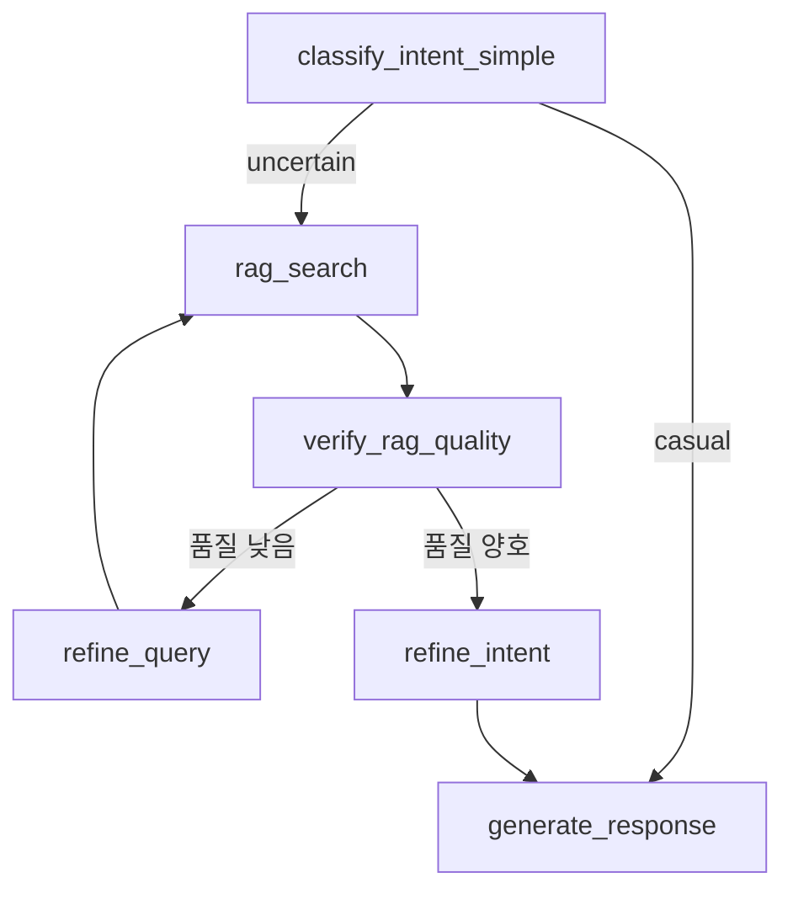

# 쿼리 개선 기능 (Query Refinement with LangGraph)

## 개요

맞춤법 오류가 있는 쿼리(예: "카반 보드" → "칸반 보드")를 자동으로 교정하여 정확한 검색 결과를 제공하는 기능입니다.

**방식 B (LangGraph 자가 교정 루프)**로 구현되어, 검색 과정의 의사결정이 투명하고 확장 가능합니다.

## 주요 특징

### 1. **Two-Stage RAG 검색 전략**

```
사용자 쿼리: "카반 보드가 뭐야?"
  ↓
[1차 검색] "카반 보드" → 결과 없음
  ↓
[품질 검증] 품질 낮음 (문서 0개)
  ↓
[쿼리 개선] 키워드 추출 → "카반 보드"
  ↓
[2차 검색] "카반 보드" → 결과 2개 (낮은 유사도)
  ↓
[품질 검증] 품질 낮음 (키워드 매칭 실패)
  ↓
[쿼리 개선] 문서에서 유사 용어 탐색 → "칸반 보드" 발견!
  ↓
[3차 검색] "칸반 보드" → 결과 10개 (높은 유사도)
  ↓
[품질 검증] 품질 양호 ✅
  ↓
[응답 생성] 정확한 답변 제공
```

### 2. **LangGraph 워크플로우**



**새로 추가된 노드:**

- `verify_rag_quality`: RAG 검색 결과 품질 검증
- `refine_query`: 쿼리 개선 (키워드 추출 + 유사 용어 탐색)
- `should_refine_query`: 재검색 여부 결정 (조건부 라우팅)

### 3. **쿼리 개선 전략**

#### **전략 1: 키워드 추출 (1차 시도)**

- 조사, 불용어 제거
- 핵심 명사만 추출하여 검색 범위 확대

```python
"카반 보드가 뭐야?" → ["카반", "보드"]
```

#### **전략 2: 유사 용어 탐색 (2차 시도)**

- 1차 검색 결과 문서에서 n-gram 추출
- 퍼지 매칭(Fuzzy Matching)으로 유사한 용어 찾기
- 유사도 70% 이상인 용어로 재검색

```python
문서 내용: "칸반 보드는 애자일 방법론..."
쿼리 키워드: "카반"
  ↓ 퍼지 매칭
유사 용어 발견: "칸반" (유사도 90%)
  ↓
재검색: "칸반 보드"
```

### 4. **품질 평가 기준**

```python
품질 점수 = 문서 개수 점수 (0.4) + 키워드 매칭 점수 (0.6)

# 문서 개수 점수
- 3개 이상: +0.4
- 1~2개: +0.2
- 0개: +0.0

# 키워드 매칭 점수
- 50% 이상 문서가 키워드 포함: +0.6
- 일부 문서만 키워드 포함: +0.3
- 키워드 매칭 실패: +0.0

# 재검색 조건
- 품질 점수 < 0.6 → 재검색
- 재시도 횟수 < 2 → 재검색
- 그 외 → 다음 단계 진행
```

## 코드 변경 사항

### 1. `chat_workflow.py` - 상태 스키마 확장

```python
class ChatState(TypedDict):
    # ... 기존 필드 ...

    # 쿼리 개선 관련 필드 추가
    current_query: str          # 현재 검색 쿼리 (개선될 수 있음)
    retry_count: int            # 재시도 횟수
    extracted_terms: List[str]  # 추출된 핵심 용어
```

### 2. 새로운 노드 추가

- `verify_rag_quality_node()`: RAG 품질 검증
- `refine_query_node()`: 쿼리 개선
- `should_refine_query()`: 재검색 라우팅 결정

### 3. 헬퍼 메서드 추가

- `_extract_keywords()`: 키워드 추출
- `_find_similar_terms_in_docs()`: 유사 용어 탐색

## 설치 및 실행

### 1. 의존성 설치

```bash
cd /home/daniel/projects/pms-ic/llm-service
pip install -r requirements.txt
```

**새로 추가된 의존성:**

- `rapidfuzz>=3.0.0`: 퍼지 매칭 라이브러리

### 2. 서비스 시작

```bash
# Docker 서비스 시작 (Neo4j 포함)
docker compose up -d

# LLM 서비스 시작
python3 app.py
```

### 3. 테스트

**간단한 테스트 (의존성 없이):**

```bash
python3 test_query_refinement_simple.py
```

**전체 통합 테스트:**

```bash
python3 test_query_refinement.py
```

## 사용 예시

### API 호출

```bash
curl -X POST http://localhost:8000/api/chat \
  -H "Content-Type: application/json" \
  -d '{
    "message": "카반 보드가 뭐야?",
    "context": []
  }'
```

### 응답 예시

```json
{
  "reply": "칸반 보드는 애자일 방법론에서 사용하는 시각적 관리 도구입니다...",
  "confidence": 0.85,
  "intent": "pms_query",
  "rag_docs_count": 5,
  "debug_info": {
    "rag_quality_score": 1.0,
    "rag_quality_reasons": [
      "충분한 문서 수 (5개)",
      "키워드 매칭 양호 (100%)"
    ],
    "query_refinement": {
      "original_query": "카반 보드가 뭐야?",
      "final_query": "칸반 보드",
      "retry_count": 2,
      "extracted_terms": ["칸반 보드"]
    },
    "search_query_attempt_0": "카반 보드가 뭐야?",
    "refined_query_1": "카반 보드",
    "search_query_attempt_1": "카반 보드",
    "refined_query_2": "칸반 보드",
    "search_query_attempt_2": "칸반 보드"
  }
}
```

**디버그 정보 해석:**

- `original_query`: 사용자가 입력한 원본 쿼리
- `final_query`: 최종적으로 사용된 쿼리 (교정됨)
- `retry_count`: 2번 재시도 → 3번의 검색 시도
- `search_query_attempt_X`: 각 시도별 검색 쿼리
- `refined_query_X`: 각 시도별 개선된 쿼리

## 테스트 케이스

| 쿼리                        | 예상 교정          | 설명               |
| --------------------------- | ------------------ | ------------------ |
| "카반 보드가 뭐야?"         | "칸반 보드"        | 맞춤법 오류        |
| "스크램 방법론"             | "스크럼"           | 맞춤법 오류        |
| "플래닝포커"                | "플래닝 포커"      | 띄어쓰기 오류      |
| "간트차트"                  | "간트 차트"        | 띄어쓰기 오류      |
| "애자일 방법론"             | (교정 불필요)      | 정상 쿼리          |
| "블록체인 개발"             | (교정 불가)        | 범위 밖 질문       |

## 장점

### 1. **자동 용어 학습**

- RAG에 새 문서 추가 시 자동으로 새로운 용어 활용
- 별도 용어 사전 유지보수 불필요

### 2. **투명한 의사결정**

- LangGraph 워크플로우로 검색 과정 시각화
- 디버깅 및 모니터링 용이

### 3. **확장 가능**

- 새로운 쿼리 개선 전략 추가 가능
- 재시도 횟수, 품질 임계값 조정 가능

### 4. **문맥 기반 교정**

- 실제 문서에서 사용되는 정확한 용어 활용
- 도메인 특화 용어에 강건

## 제한 사항

1. **재시도 횟수 제한**: 최대 2번 재시도 (총 3번 검색)
2. **퍼지 매칭 임계값**: 유사도 70% 이상만 인정
3. **RAG 문서 의존**: RAG에 관련 문서가 없으면 교정 불가

## 향후 개선 가능 사항

1. **맞춤법 검사기 통합**: `hanspell` 라이브러리 추가
2. **도메인 특화 사전**: PMS 용어 사전 구축 (선택적)
3. **임베딩 모델 개선**: 한글 특화 모델 사용
4. **LLM 기반 쿼리 재작성**: GPT를 사용한 쿼리 개선

## 디버깅 팁

### 로그 확인

```bash
# LLM 서비스 로그에서 쿼리 개선 과정 추적
grep "Refining query" llm-service.log
grep "Quality score" llm-service.log
grep "Routing decision" llm-service.log
```

### 로그 출력 예시

```
🔍 Performing RAG search for: 카반 보드가 뭐야?
   Retry count: 0
  📋 RAG service returned 0 results
  ✅ Final RAG results: 0 documents

🔍 Verifying RAG quality: 0 docs, retry: 0
  📊 Quality score: 0.00
  📝 Reasons: 문서 없음

🔀 Routing decision: quality=0.00, retry=0/2
  🔄 Refining query (attempt 1)

🔧 Refining query (attempt 1)
   Original: 카반 보드가 뭐야?
   Current:  카반 보드가 뭐야?
  📌 Strategy 1: Extracted keywords → '카반 보드'
  ✨ Refined query: '카반 보드'

🔍 Performing RAG search for: 카반 보드
   Retry count: 1
  📋 RAG service returned 2 results
  ✅ Final RAG results: 2 documents

🔍 Verifying RAG quality: 2 docs, retry: 1
  📊 Quality score: 0.20
  📝 Reasons: 일부 문서 발견 (2개), 키워드 매칭 실패

🔀 Routing decision: quality=0.20, retry=1/2
  🔄 Refining query (attempt 2)

🔧 Refining query (attempt 2)
   Original: 카반 보드가 뭐야?
   Current:  카반 보드
    🔍 '카반' → '칸반 보드' (유사도: 90%)
  🎯 Strategy 2: Found similar term in docs → '칸반 보드'
  ✨ Refined query: '칸반 보드'

🔍 Performing RAG search for: 칸반 보드
   Retry count: 2
  📋 RAG service returned 10 results
  ✅ Final RAG results: 5 documents

🔍 Verifying RAG quality: 5 docs, retry: 2
  📊 Quality score: 1.00
  📝 Reasons: 충분한 문서 수 (5개), 키워드 매칭 양호 (100%)

🔀 Routing decision: quality=1.00, retry=2/2
  ✅ Proceeding to next step
```

## 문의

구현 관련 질문이나 버그 리포트는 이슈 트래커에 등록해주세요.
